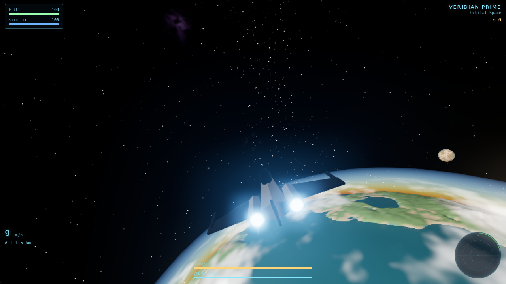
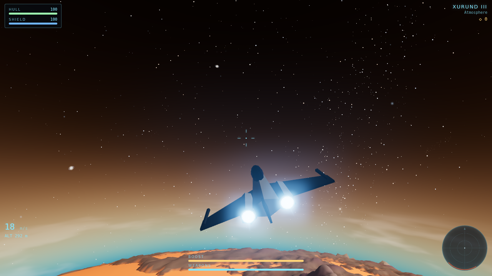

# Starfall Frontier

A seamless 3D space-exploration and combat game for the browser — built for
mobile, playable anywhere. Fly a fighter from deep space through a planet's
atmosphere down to meters above its mountains and back, with no loading
screens, across a procedurally generated star system of nine unique worlds.



## Play

**On a Mac, the easiest way is to double-click `run.command`** — it installs
what's needed and opens the game in your browser, no deploy required. Full
step-by-step (including testing on your iPhone over Wi-Fi) is in
[`LOCAL_DEV.md`](LOCAL_DEV.md). To deploy to Netlify, see [`DEPLOY.md`](DEPLOY.md).

Or from a terminal:

```bash
npm install        # once
npm start          # run locally + open the browser  (npm run dev = no auto-open)
npm run build      # production bundle in dist/
```

Open the printed URL. On a phone, use the on-screen sticks; on desktop:

| Input | Action |
| --- | --- |
| Mouse | Steer (pitch/yaw) |
| `W` / `S` | Forward / reverse thrust |
| `A` / `D` | Roll |
| `Q` / `E`, `R` / `F` | Strafe |
| `Shift` | Boost |
| `Space` / click | Fire |
| `X` | Flight-assist brake |

Touch: left stick steers, right stick is throttle (vertical) and roll
(horizontal), plus FIRE and BOOST buttons.

## What's in the universe

- **Nine procedural worlds** — terran, ocean, ice, desert, volcanic and
  airless cratered archetypes, each with unique terrain, palettes,
  atmosphere tint, clouds and gravity, generated from one master seed.
- **Seamless planetfall** — quadtree cube-sphere terrain streams in as you
  descend; your speed envelope scales from interplanetary cruise to
  treetop flight automatically. Gravity ramps up on approach; atmospheres
  add drag, wind, entry heat and scattering skies with real sunsets.
- **Exploration first** — derelict stations, wrecked warships, orbiting
  relay satellites, hidden caches and anomalies that permanently upgrade
  your ship. Unknown-signal pings lead you off the beaten path.
- **Combat as punctuation** — pirates hold territory around the richest
  finds. Scouts juke, fighters brawl, heavies anchor. Ships detect, chase,
  dodge, fire and retreat below 28% hull. Wrecks drop magnetic salvage.
- **A living backdrop** — thousands of stars, painted nebulas and
  galaxies, instanced asteroid fields you can mine with lasers, and one
  real sun lighting everything.



## Architecture

```
src/
  core/          engine, game loop, input, procedural audio, pooling,
                 floating origin, adaptive quality, save games
  ship/          shared ship chassis, procedural ship meshes, player flight
  ai/            enemy FSM, squad manager, encounter director
  combat/        weapons, damage flow, pickups, ramming
  world/         planet descriptors, terrain sampling, quadtree LOD,
                 atmosphere/ocean/cloud shaders, universe generation
  environment/   sun, starfield, nebulas, asteroid fields, space dust
  exploration/   points of interest, discovery rewards
  fx/            engine glow, shields, explosions, shared FX textures
  ui/            HUD, radar, touch controls, screens
  camera/        chase camera with trauma shake
```

Design decisions worth knowing before hacking:

- **Floating origin.** Game logic runs in JS doubles; whenever the player
  strays 8k units from origin the whole world rebases so the GPU only ever
  sees small coordinates. Anything that stores a world position subscribes
  to `game.origin.onShift`.
- **One terrain sampler per planet** (`world/terrainHeight.js`) feeds the
  mesher, the collision system and the AI — what you see is exactly what
  you hit.
- **Procedural-first, with four hand-modeled hulls.** Planet surfaces,
  nebulas, FX textures and the entire soundscape (WebAudio synthesis —
  engines, lasers, wind, music) are generated at runtime. The only binary
  assets are the four hand-authored ship models in `public/models-glb/`
  (`starter`, `gunship`, `dreadnought`, `flagship` — meshopt-compressed GLB,
  ~3.7 MB total) that hot-swap in over procedural stand-ins as they load.
- **Mobile budget.** Pooled projectiles/explosions/patches, instanced
  asteroids, patch builds time-boxed per frame, dynamic resolution scaling
  driven by measured frame time, one shadow-casting light with a tight
  frustum, HDR + bloom on a half-float target with MSAA.

## Development

`tools/screenshot.mjs` drives the game in headless Chromium for render
smoke-tests and screenshots:

```bash
node tools/screenshot.mjs http://localhost:5173 out.png 4000 \
  '[{"type":"tap"},{"type":"key","code":"KeyW","ms":2000}]'
```

Append `?debug` to the game URL for an FPS/draw-call/triangle readout.
